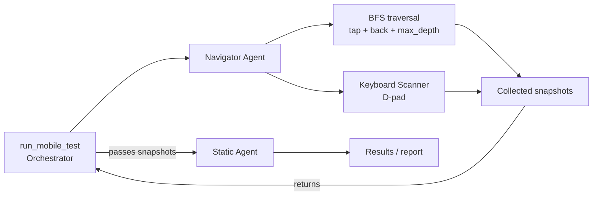

# Mobile Accessibility Agent

## 1. Architecture Overview

- **Orchestrator (`run_mobile_test`)** — The entry point. It calls the Navigator Agent, passes the collected snapshots to the Static Agent, and finalizes the results.
- **Navigator Agent** — A pure data collector that drives the app with Appium and UiAutomator2. It explores screens using breadth-first search (tap, back, and `max_depth`) and collects accessibility-tree snapshots, screenshots, and keyboard scan results. D-pad focus traversal checks reachability, focus order, and focus traps. It also handles screen deduplication with MD5 hashes, scroll detection, drawer/hamburger discovery, and dialogs or modals.
- **Static Agent** — Orchestrates deterministic consumers. For every Navigator snapshot, it runs rule-based WCAG checks through classes such as `NameRoleValueConsumer`, `TouchTargetConsumer`, `FormLabelConsumer`, `PageTitleConsumer`, and `FocusOrderConsumer`. It is currently a Python class and will evolve into an ADK `LlmAgent` as LLM-based consumers are introduced.

**Technologies:** Google ADK (Agent Development Kit), Appium with UiAutomator2, D-pad keyboard traversal, BFS graph exploration, and accessibility-tree XML parsing.

## 2. Agent Flow Diagram



## 3. Future Improvements

1. **Parallelization** — Run Navigator and keyboard scans across N emulators assigned to different app sections; stream snapshots to the Static Agent through an asynchronous queue; and parallelize consumers after navigation. || DONE
2. **Semantic Agent** — Crop screenshot regions using element bounds and send them to a multimodal LLM to assess `contentDescription` adequacy and classify images as decorative or informative, covering WCAG 1.1.1.
3. **Static Agent → `LlmAgent` evolution** — Promote the Static Agent to an ADK sub-runner and add LLM-based consumers for subjective checks such as title adequacy, label quality, visual layout relationships, and reading order in complex layouts.
4. **Additional consumers** — Add `ContrastConsumer` for pixel analysis, `OrientationConsumer`, event-based `NotificationConsumer`, and `DialogFocusTrapConsumer`.

## 4. Using the Agents through MCP

Start the MCP server with an Appium server and Android emulator or device available.

From an MCP client, use the tools in this order:

1. Call `get_test_capabilities` with `{}` to list available devices.
2. Call `run_full_mobile_test` to invoke the Orchestrator, Navigator, and Static Agent workflow:

```json
{
  "app_package": "com.example.app",
  "app_activity": ".MainActivity",
  "capability_id": "<id-from-get_test_capabilities>",
  "max_steps": 50,
  "max_activities": 3,
  "max_depth": 5,
  "instructions": ""
}
```

Only `app_package` and `app_activity` are required. `capability_id` may be omitted when exactly one device is detected. The tool returns the test result and a report ID; use `get_report_file` with that ID and `json`, `powerpoint`, or `excel` to retrieve a report.

## 5. Implemented Rules

| WCAG success criterion | Implemented check | Responsible sub-agent / component |
| --- | --- | --- |
| 1.1.1 Non-text Content | Detects interactive images without a programmatically determinable text alternative. | Static Agent - `NonTextContentConsumer` (deterministic) |
| 1.3.1 Info and Relationships; 3.3.2 Labels or Instructions | Detects `EditText` controls with no label, generic hints, or no specific input type. | Static Agent - `FormLabelConsumer` (deterministic) |
| 1.3.2 Meaningful Sequence | Detects significant mismatches between accessibility-tree order and visual reading order. | Static Agent - `MeaningfulSequenceConsumer` (deterministic) |
| 1.4.3 Contrast (Minimum) | Evaluates screenshot evidence for insufficient text contrast. | Static Agent - `MobileStaticContrastAgent` (LLM) |
| 1.4.11 Non-text Contrast | Evaluates screenshot evidence for insufficient contrast of UI components and meaningful graphics. | Static Agent - `MobileStaticContrastAgent` (LLM) |
| 2.4.2 Page Titled | Detects missing or generic Android activity titles. | Static Agent - `PageTitledConsumer` (deterministic) |
| 2.5.3 Label in Name | Detects interactive controls whose accessible name does not include their visible label. | Static Agent - `LabelInNameConsumer` (deterministic) |
| 2.5.8 Target Size (Minimum) | Detects interactive touch targets smaller than 48 x 48 dp, excluding inline text exceptions. | Static Agent - `TouchTargetConsumer` (deterministic) |
| 4.1.2 Name, Role, Value | Detects interactive controls with missing meaningful names, semantic roles, states, or values. | Static Agent - `NameRoleValueConsumer` (deterministic) |

`MobileStaticInitAgent` also performs an evidence-based LLM analysis against the Android and iOS mobile criteria defined in `src/prompts/wcag_mobile.yml`. It reports only violations supported by the collected accessibility snapshot. The `MobileMergeReportsAgent` merges deterministic, contrast, and LLM findings into the final report.
